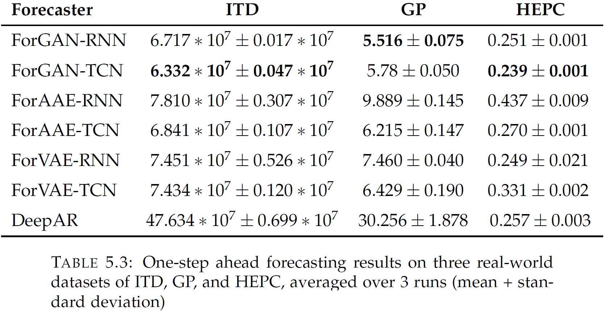
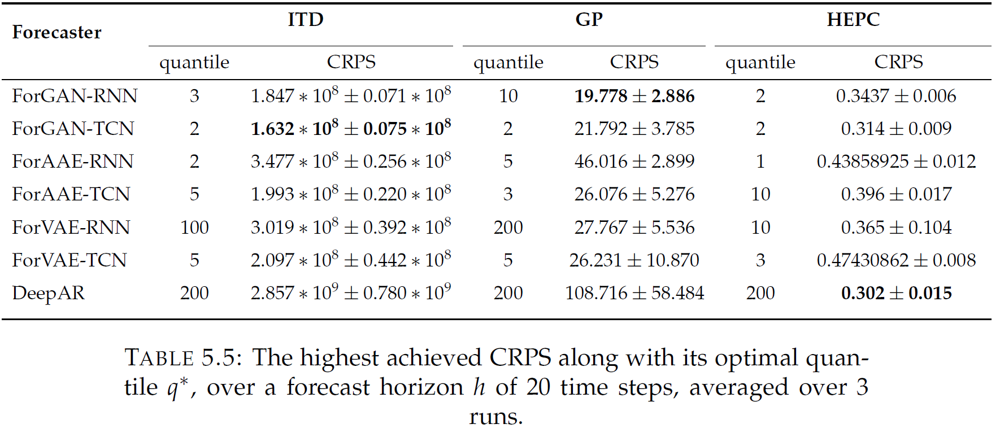
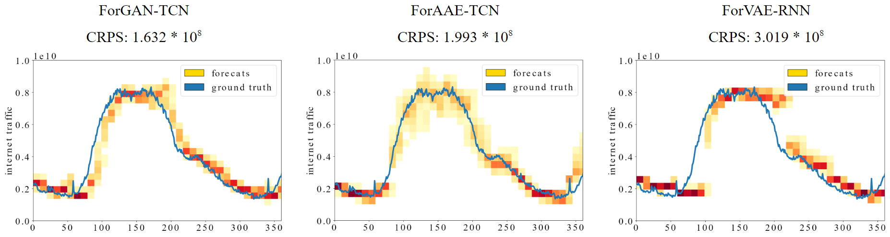

# Performance Evaluation of Implicit Generative Models for Probabilistic Forecasting  
  
A comprehensive investigation to analyze deep implicit generative models as probabilistic time-series forecasters
  
## Features  
* Three leading deep implicit generative models implemented with [PyTorch](https://pytorch.org/) (see [list](#available-models))  
* Utilities for loading and iterating over uni-variate time series datasets  (see [list](#available-datasets)) 
* Utilities to define hyper-parameter ranges to tune models  
* Utilities to evaluate models performance of predictions in one-step ahead forecasting and multi-step ahead forecasting

## Abstract
Dealing with time series data forecasting has long been a pervasive and challenging problem, owing to the data's complicated temporal dependencies. While accurate forecasting is critical in a wide variety of decision-making circumstances. For many years, statistical deterministic forecasting models were the state-of-the-art for time-series forecasting, which aim to forecast the most probable future value. Nevertheless, deterministic models can only predict a single forecast value and offer no information about the underlying uncertainty. Thus, it is crucial that predictions be probabilistic with a high degree of reliability and accuracy. In this light, exploratory research on the accuracy and reliability of various probabilistic forecaster models enables scientists to strengthen their capability for time-dependent analysis. Yet, thorough comparative studies comparing the applicability of time series probabilistic forecaster models to one another do not exist. This research conducts a comprehensive investigation to analyze the performance of several implicit generative models as probabilistic forecasters in order to establish which time-series forecasting models are best suited to certain real-world challenges. The study comprises numerous series of experiments on four publicly accessible time-series datasets to compare the efficiency of implicit generative models of GANs, VAEs, and AAEs to that of the explicit generative model DeepAR. These experiments explore one-step ahead forecasting, multi-step ahead forecasting, and the effect of forecast quantile and horizon on forecasting tasks. The findings indicate that implicit generative models can be utilized for probabilistic forecasting on time-series data, while the predictions' accuracy is highly reliant on the properties of the time-series data and the model structure. 
  
## Available models  
  Forecaster name    | Corresponding generative model name        | Model category   | Architecture        | References  
:-------------------:|:------------------------------------------:|:----------------:|:-------------------:|:-----------:  
ForGAN               | Generative Adversarial Network (GAN)       | Implicit         | RNN (GRU/LSTM), TCN | [GAN](https://proceedings.neurips.cc/paper/2014/file/5ca3e9b122f61f8f06494c97b1afccf3-Paper.pdf), [ForGAN](https://doi.org/10.48550/arXiv.1903.12549)
ForAAE               | Adversarial Autoencoder (AAE)              | Implicit         | RNN (GRU/LSTM), TCN | [AAE](https://doi.org/10.48550/arXiv.1511.05644)
ForVAE               | Variational Autoencoder (VAE)              | Implicit         | RNN (GRU/LSTM), TCN | [VAE](https://doi.org/10.48550/arXiv.1312.6114)
DeepAR               | -                                          | Explicit         | RNN (GRU/LSTM)      | [DeepAR](https://doi.org/10.1016/j.ijforecast.2019.07.001)              

## Available datasets 
  Name                      		  		  | Data layout     | Dataset length    | Dataset range   									   | Sample rate  
:--------------------------------------------:|:---------------:|:-----------------:|:----------------------------------------------------:|:------------:  
Lorenz (toy dataset)      			  		  | Univariate      | 100000			| [-11, 11]   	  									   | 26 seconds
Internet Traffic Dataset (ITD)        		  | Univariate      | 14772             | [7 &times; 10<sup>8</sup>, 9 &times; 10<sup>9</sup>] | 5 minutes
Gold Price (GP)				         		  | Univariate      | 2487 	            | [1000, 2000]     									   | 1 day
Household Electric Power Consumption (HEPC)   | Univariate      | 34569             | [0, 6]         									   | 1 hour

## Tuning
All the models can be tuned as follows:
```
python main.py --model_name model_name --dataset_name dataset_name --mode 0 --max_steps 5000 --batch_size 128 --horizon 1 --tune_cell tune_cell 
```
where model_name is one of `{GAN, AAE, VAE, DeepAR}`, dataset_name is one of `{lorenz, itd, gp, hepc}`, and tune_cell can be one of `{RNN, TCN}`. One can also change the following variables as needed:
* max_steps: max number of steps to tune the model
* horizon: the desired number of ahead steps to tune the model
* max_device: max number of available cuda device
* process_per_device: max number of parallel processes on a cuda device

For extensive example of tuning, please refer to the [script folder](./scripts/)  

## Running
All the models can be run as follows:
```
python main.py --model_name model_name --dataset_name dataset_name --mode 1 --horizon 1
```
where model_name is one of `{GAN, AAE, VAE, DeepAR}`, and dataset_name is one of `{lorenz, itd, gp, hepc}`. One can also change each models' corresponding variables. For extensive example of running, please refer to the [script folder](./scripts/)  

## Results
### One-step ahead forecasting on real-world datasets


### Multi-step ahead forecasting on real-world datasets


### Visualizations of Forecasts on ITD


## Work in Progress
* Investigating not just implicit generative models, but also a broader variety of deep generative models, such as Boltzmann machines, in more depth. By considering a broader selection of forecaster models, we can provide a more comprehensive comparative analysis.
* Evaluating forecaster models on a wider range of time-series datasets, such as those comprising multivariate real-world time-series data.
* Considering alternative architectures such as CNNs while developing frameworks for forecaster models. It enables us to conduct a more thorough investigation of the impact of base architectures on the accuracy of forecasts.